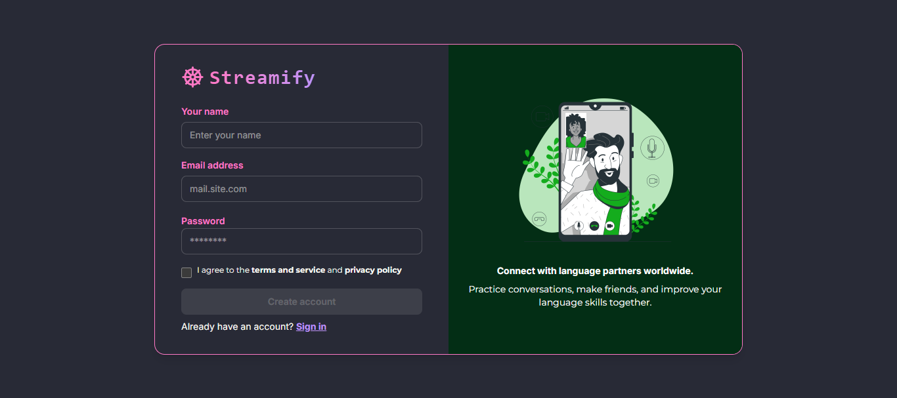
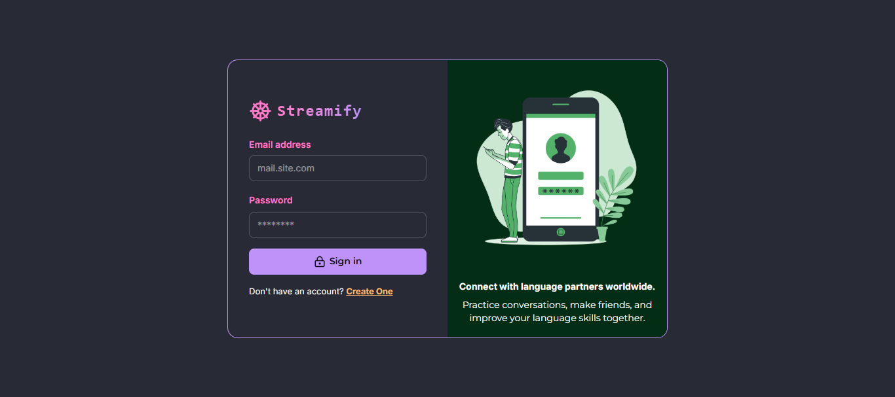
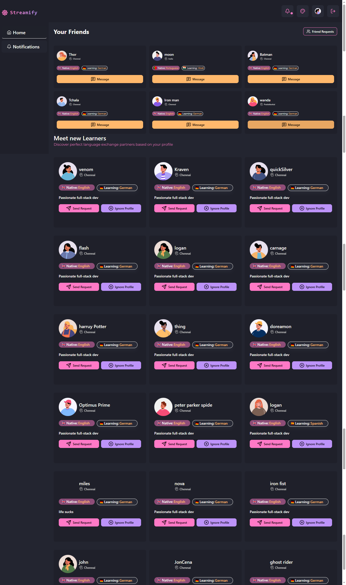
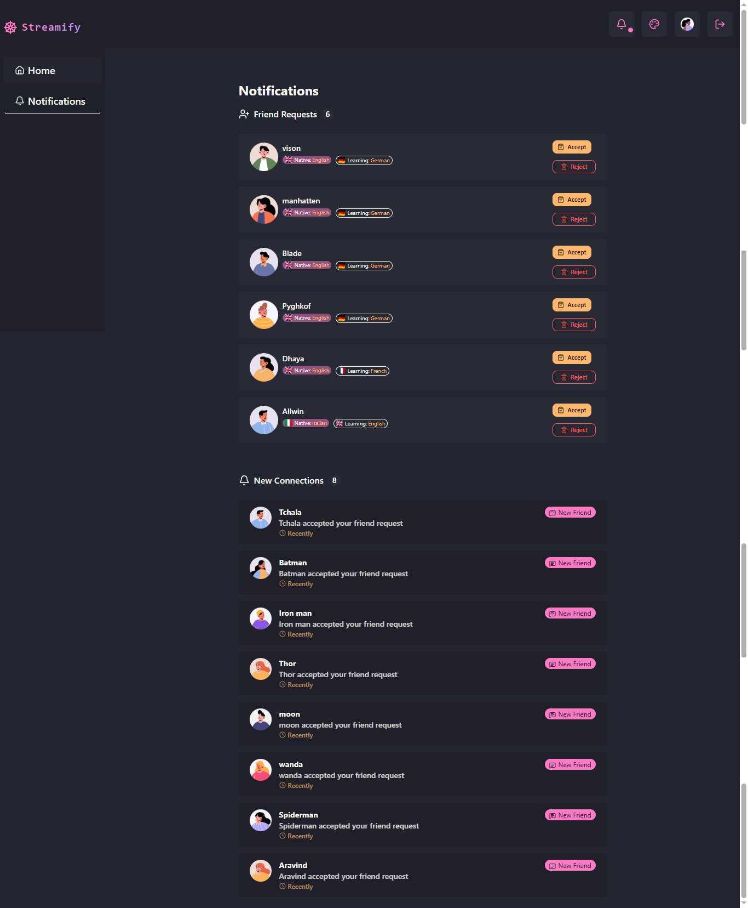
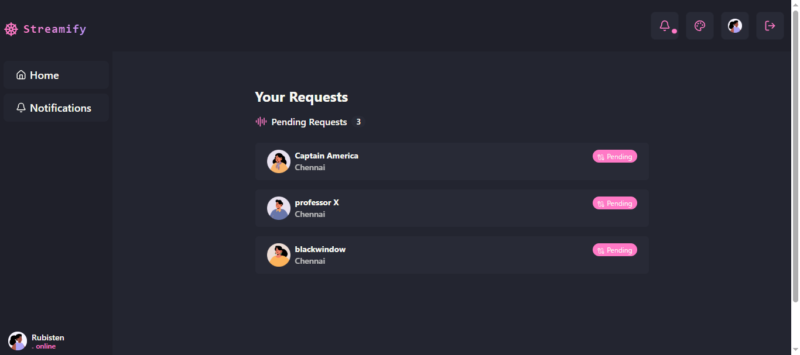
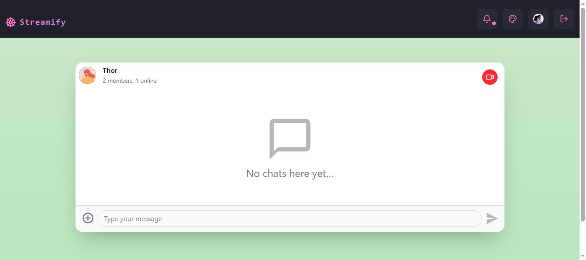
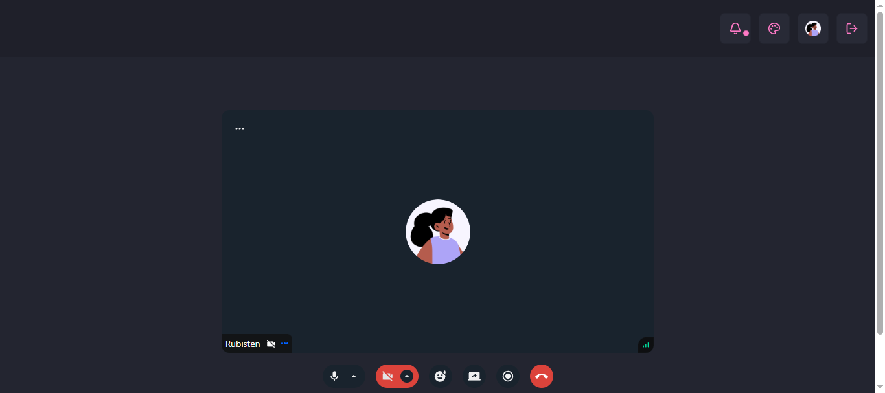

# Streamify

A **language learning platform** built on the **MERN stack** with real-time **chat** and **video calling** powered by **getstream.io**.  
Users can connect, send requests, accept/reject/ignore invitations, and practice languages in an interactive environment.  

Built with **React, Node.js, Express, MongoDB, Redux, React Query, DaisyUI, and Stream SDKs**.

---

## 🚀 Features
- 🔐 **Authentication & Authorization** (JWT, bcrypt)  
- 🤝 **Send, Accept, Reject & Ignore Requests**  
- 💬 **Real-time Chat** with Stream Chat API  
- 🎥 **One-to-One Video Calls** with Stream Video SDK  
- 🎨 **Dynamic Theming** using DaisyUI (dark/light & custom themes)  
- 📦 **Global State Management** with Redux Toolkit  
- ⚡ **Server State Handling** with React Query  
- 🌐 **Secure REST APIs** with Express & Mongoose  

---

## 🛠 Tech Stack

### Frontend
- React 19, React Router v7  
- Redux Toolkit  
- React Query  
- TailwindCSS + DaisyUI (Dynamic themes)  
- Lucide Icons  
- Stream Chat React & Stream Video SDK  

### Backend
- Node.js + Express  
- MongoDB + Mongoose  
- JWT Authentication  
- Bcrypt (password hashing)  
- Validator (input validation)  
- Stream Chat API  

---

## 📸 Project Preview

### 🔑 Authentication



### 👤 User Dashboard


### 🤝 Connection Requests


### 🎥 My Requests


### 💬 Real-time Chat


### 🎥 Video Calling



---

## 📂 Folder Structure
```
project-root/
│── backend/         
│   ├── src/
│   │   ├── controllers/   # Business logic
│   │   ├── middlewares/   # Auth & validation
│   │   ├── lib/           # External services & integrations
│   │   ├── models/        # Mongoose schemas
│   │   ├── routes/        # API routes
│   │   ├── utils/         # Helpers
│   │   └── server.js      # App entry point
│   ├── .env               # Backend environment variables
│   ├── package.json
│
│── frontend/              
│   ├── src/
│   │   ├── assets/         # Images, fonts, etc.
│   │   ├── components/     # Reusable components
│   │   ├── layout/         # Layout components
│   │   ├── notification/   # Notification-related components
│   │   ├── chat/           # Chat UI components
│   │   ├── own-request/    # User's own request handling
│   │   ├── utilComponents/ # Small utility components
│   │   ├── constants/      # Global constants
│   │   ├── hooks/          # Custom React hooks
│   │   ├── store/          # Redux store
│   │   ├── pages/          # Application pages
│   │   ├── lib/            # API / external helpers
│   │   ├── utils/          # Utilities
│   │   ├── App.jsx
│   │   ├── main.jsx
│   │   └── App.css
│   ├── .env                # Frontend environment variables
│   ├── .gitignore
│   ├── package.json
│
│── screenshots/            # Images for README.md
│── README.md
```

---

## ⚙️ Installation & Setup

### 1. Clone the repo
```bash
git clone https://github.com/Rubin737/connectdev
cd connectdev
```

### 2. Install dependencies

#### Backend
```bash
cd backend
npm install
```

#### Frontend
```bash
cd frontend
npm install
```

### 3. Environment Variables
Create a `.env` file in `backend/` with:

```env
PORT=5000
MONGO_URI=your_mongo_connection_string
JWT_SECRET=your_secret_key
STREAM_API_KEY=your_stream_api_key
STREAM_API_SECRET=your_stream_api_secret
```

---

## ▶️ Running the App

### Backend
```bash
cd backend
npm run dev
```

### Frontend
```bash
cd frontend
npm run dev
```

---

## 📦 Build for Production
```bash
cd frontend
npm run build
```

---

## 🔮 Future Enhancements
- AI-powered **language suggestions**  
- Group video calls & screen sharing  
- Gamified learning system  

---

## 📜 License
This project is licensed under the MIT License.
